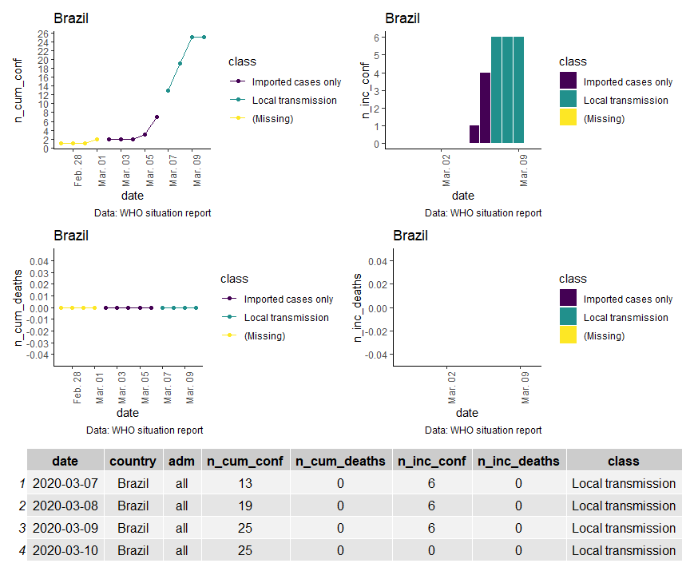

<!-- README.md is generated from README.Rmd. Please edit that file -->

# covid19viz

<!-- badges: start -->

[](https://www.tidyverse.org/lifecycle/#experimental)
[](https://cran.r-project.org/package=covid19viz)
<!-- badges: end -->

The goal of `covid19viz` is to summarize WHO sitreps for covid-19 in
simple graphics.

This package works using the
[fkrauer/COVID-19](https://github.com/fkrauer/COVID-19) reporsitory.

## Installation

<!--
You can install the released version of covid19viz from [CRAN](https://CRAN.R-project.org) with:

``` r
install.packages("covid19viz")
```
-->

You can install the development version of `covid19viz` using:

``` r
if(!require("remotes")) install.packages("remotes")
remotes::install_github("cdcperu/covid19viz")
```

## Quick Example

``` r
library(sitreper)

#paste
path_file <- "https://raw.github.com/fkrauer/COVID-19/master/data/WHO_COVID19_ALL_ADM0_2020-03-10.csv"

#apply
who_sitrep_country_report(
  data_input = path_file,
  country = "Brazil")
#> Parsed with column specification:
#> cols(
#>   date = col_date(format = ""),
#>   country = col_character(),
#>   adm = col_character(),
#>   n_cum_conf = col_double(),
#>   n_cum_deaths = col_double(),
#>   n_inc_conf = col_double(),
#>   n_inc_deaths = col_double(),
#>   class = col_character()
#> )
```


